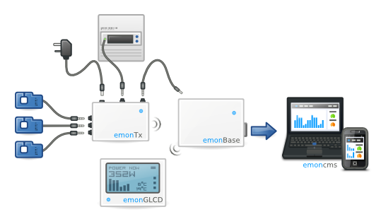

**Welcome to EmonHub Documentation**
----------------------------------
----------------------------------

This software is part of OpenEnergyMonitor project.

### **EmonHub** *(erstwhile oem-gateway)*

EmonHub is based on the excellent OEM gateway, revised, repackaged and relaunched. 

### *emonHub is the perfect partner to emonCMS*

Currently the OpenEnergyMonitor project's most popular emonBase option is the Raspberry Pi, usually used either as a standalone forwarder running the OEM gateway or as a full emonCMS server installation using either the python or php input scripts. 

The emonHub software aims to unify these approaches into one multipurpose software that can run independently as a forwarder or on the same machine as a part of a full emonCMS installation.

